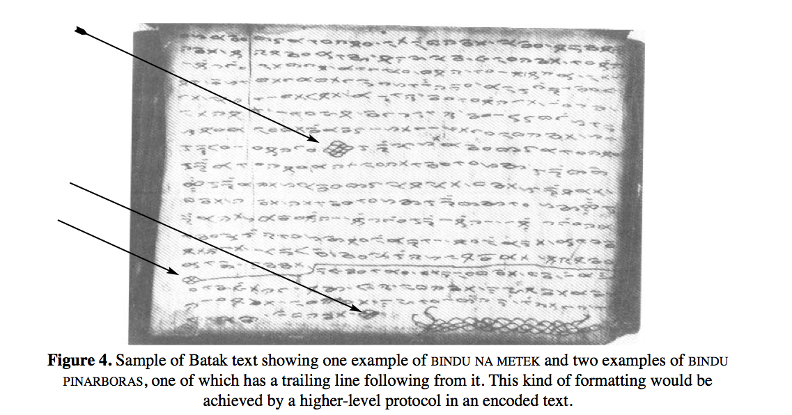
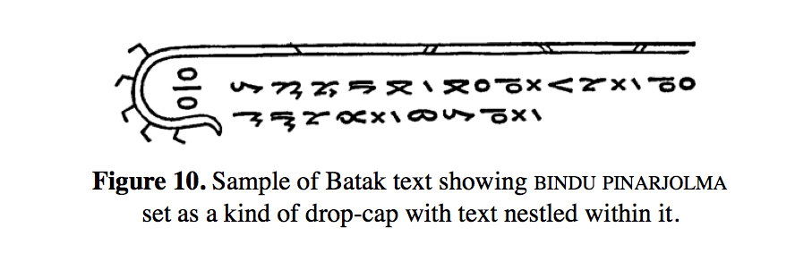
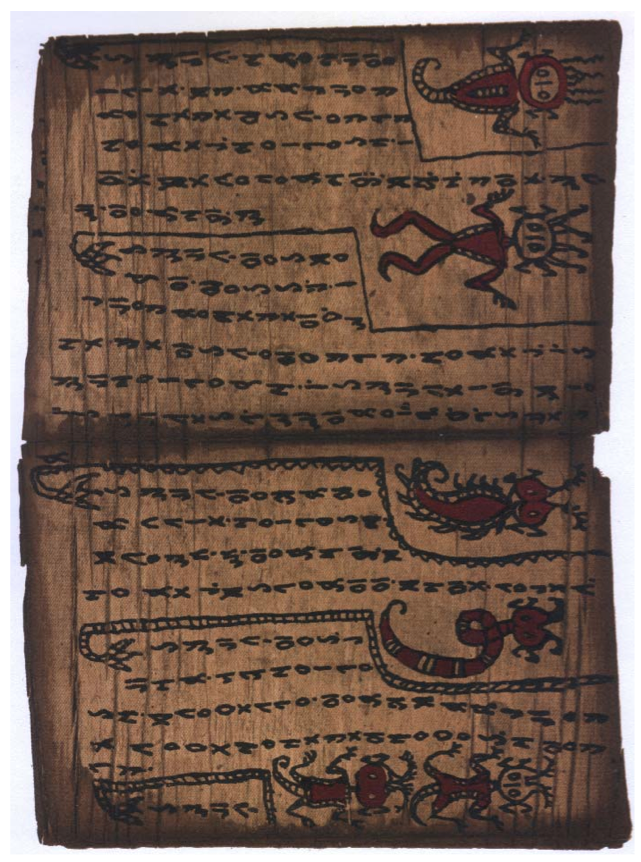
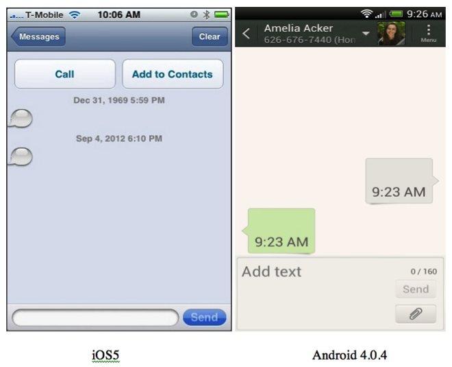

# Emoji Ethnicity

Earlier this month, a campaign to expand the diversity of emojis available to iPhone users was answered by Apple's vice president of corporate communications, Katie Cotton.  Now that emojis have been encoded for use on Android and Apple platforms alike, their popularity is growing, increasingly serving as [stand-ins for words themselves.](http://www.theatlantic.com/technology/archive/2014/04/these-emojis-would-like-to-help-you-structure-your-data/360365/).  In response to [an article](http://act.mtv.com/posts/apple-responds-to-lack-of-diversity-in-emojis/) by Joey Parker for MTV responding to a petition decrying the lack of diversity in emojis save for two with specific ethnic markers.

> Our emoji characters are based on the Unicode standard, which is necessary for them to be displayed properly across many platforms.  There needs to be more diversity in the emoji character set, and we have been working closely with the Unicode Consortium in an effort to update the standard.

# "Colorless green ideas sleep furiously."

But the story is not so simple.  Apple's explanation points to the Unicode Consortium, the nonprofit foundation responsible for establishing standards for the interoperability of the world's languages.  Unicode released their encoding for emojis in April 2010, which would allow mobile phone platforms around the world to share emojis.  Rather than selecting *which* characters belonged in this alphabet, Unicode based their standard on a core set of 722 emojis in use by the top three mobile phone networks in Japan: DoCoMo, DKKI, and Softbank.  The main heft of Unicode's work was to translate each of those carrier-specific encodings (which were stored in ISO-2022-JP) to a single standard that could then play nicely with any international character set.  [Here](http://www.au.kddi.com/ezfactory/tec/spec/img/typeD.pdf), for example, is a chart showing all of KDDI's 822 emoji encodings.

Further, while the Unicode standard does include two faces with deliberate ethnic markers (1F472 👲 Man With Gua Pi Mao and 1F473 👳 Man With Turban), all of the other human faces can be interpreted or rendered in radically different ways.  Every character included in Unicode is given a four-digit hexadecimal number called a "code point."  It then takes a font to actually render these code points as a specific "glyph," which is the graphical skin built upon that hexadecimal foundation.  Thus when your computer reads 1F366 it displays 🍦.  But the ice cream cone on my Android phone will look nothing like the ice cream cone on your iPhone.  And so the appearance of a human face can vary depending on the font it is rendered in.  Unicode, as their [FAQ](http://www.unicode.org/faq/emoji_dingbats.html) reads, "does not require a particular racial or ethnic appearance —- or for that matter, a particular hair style: bald or hirsute."

The picture becomes muddled even further when we read Unicode's professed desire to encode emojis "primarily on their general appearance, not on an intended semantic."^[Placing the #EmojiEthnicityUpdate controversy at the doorstep of Unicode is ironic because Unicode is the primary engine by which people can translate a character from virtually any language in the world into a file format designed for virtually any other language in the world.  It is a swiss army knife of international natural language processing.]  That is, the Unicode consortium tries as much as possible to curate its list of symbols without any preconceived notions of their meaning.  Joel Spolsky, in [an article](http://www.joelonsoftware.com/articles/Unicode.html) on Unicode famous among programmers, refers to the characters encoded in Unicode as "platonic ideals … floating in heaven."  While A is different than a, A in Courier is semantically equivalent to A in Helvetica.  But if we accept this agnosticism toward the meaning of emojis, encoded emoji characters are then a syntax without semantics.  Like Noam Chomsky's famous sentence showing a syntax without semantics -- "colorless green ideas sleep furiously" --  they are pictographs that can take on entirely new meanings depending on their local applications.  "In fact," the Unicode documentation continues, "when used as emoji, many of these characters acquire multiple meanings based on their appearance; for example, an emoji character for “bank” which includes the letters “BK” has taken on the secondary meaning “bakkureru” (a slang term for evading one’s responsibilities)."

It is for this reason that we can't say precisely how many emoji have been encoded in Unicode after the original 722-character set imported from Japanese mobile characters.  Preexisting pictographs in the Unicode standard, such as 214F ⅏ "Symbol for Samaritan Source" (a character *itself* used in ancient Hebrew to translate between alphabets), could possibly be used in ways far different from its original function.^[The original Unicode proposal for this character can be found at <http://std.dkuug.dk/jtc1/sc2/wg2/docs/n3217.pdf>.]  Perhaps it's this kind of semantic drift that can turn any given character into an emoji, which we might understand as a form of flexibility.

Ultimately, this is a story about how practices develop in relation to standards.  Spolsky describes Unicode as a specific "way of thinking about characters."  But with the new means that people have for communicating with one another on mobile phones, the way that these characters "think" are becoming something completely different.  If we accept that there is a Unicode way of thinking about characters, what is the user-specific way of thinking about communication?  When emojis are beginning to look less like a language and more like a series of objects, we have to have a closer attention to *what* and *how* things mean.

Reading through the grey literature of the Unicode Consortium, for instance, we can see how difficult it has been to distinguish between a character as a semantic unit and a "graphic object" unique to the transmission of those characters.  Bindu characters in the Batak script from the Indonesian island of Sumatra, for instance, are "used to disambiguate similar words or phrases."  Is the snake-like bindu pinarjolma ("human-being shaped bindu") and its many different glyph variants an anthropomorphic character with a specific textual purpose, or is it a "graphic page element that does not behave at all as characters," in the words U.S. National Body of Unicode's argument in February 2010 (INCITS/L2/10‐066)?

Here, the distinction between a graphic object and a character becomes ambiguous, sitting somewhere in between what Jerome McGann calls the pagespace and the textspace [@mcgann_radiant_2004, 149].  What kinds of objects do we text from one personal device to the next in a form of "textured" or "fingered speech" that has no oral component, a morphology without an accompanying phonology?

# Convergence: Platforms, the Internet, Mobile computing

The backwards compatibility issue with mobile operating systems and the rise of proprietary or platform-specific library codecs/codices for messaging clients raises some interesting problems for those of concerned with the status of these texts in the moment, but also as they move through time. Emojis, their reception and circulation point to a specific emergence{convergence?} that is reckoning with mobile platforms and their connectivity with the Internet as well as the future of personal computing. Smartphones and the rise of 3G, 4G, LTE, and next generation networks that use Internet Protocol (IP) to transmit rich data to phones. Increasingly our phones can do what Internet connected personal computers. And increasingly, we see our personal computing tools mimic tools from our phones. For example, I can now download Chromoji, a browser plugin that displays Emojis in my browser. With Mac OS X Lion, the Emoji character set is available in any text input. While emoticons in have been in word processing programs like Microsoft Word since 2003, the rise of Emojis is somehow different. ☺

# Blank texts

In the early 2000s teenagers in Poland reportedly began to send each other blank text messages. According to online discussion forums like PolishForums.com, Reddit, or GSM Arena, the blank text was originally conceived as a way to communicate to your sweetheart without words. Just like most text messages, there is a sender who creates the message with a SMS client, a receiver who receives it with their mobile device, a metadata wrapper (also known as a transfer protocol data unit) for the text message as part of its transmission, and finally a mobile network to support the transmission of data between users’ devices. Except, unlike most text messages, blank texts appear empty of content in the recipient’s messaging client (see Figure 1). A way of letting your girlfriend or boyfriend know that you are thinking of them in a message that rejects the need for words. These sentimental texts are beyond, or outside of words, but still framed in the messaging client.

A decade later in a lifestyle article reporting on why texting turns working adults “back into teenagers” [@bernstein_why_2011] the blank text was described as a power play for professional New Yorkers to carry on earlier face-to-face arguments. Shortly afterwards, *Glamour* magazine’s sex and dating advice column would describe the motivation behind the blank text as a way to “score a callback” and perhaps seem mysterious to your partner [@slater_why_2013]. The blank text had become a way for Americans to continue arguments, flirt, or create confusion without the stakes of creating a textual trace within the wrapper of the text message by leaving the content of the message empty. Another way to let your sweetheart know you were annoyed with them or to cause a reaction, the blank text became a way to continue earlier encounters, a trace without a trace. Empty of textual content, but still gravid with meaning, the blank text power play puts the onus of interpreting possible meanings and varied intentionality of the sender upon the recipient. 

Indeed, blank texts have increasingly begun to appear and confuse recipients in other ways. Quite recently, Apple’s popular iPhone mobile operating system (iOS) updated to its seventh version. This version update employs a new codec of emojis, popular (sometimes animated) emoticons of cartoon faces and icons like a heart or a shovel. The iOS7 codec is proprietary and builds off of the ISO/IEC 10646 Unicode standard but it is not backwards compatible (including most other library messaging codecs) on other mobile operating systems. The result of this iOS7 platform update involves, among other incompatibility issues, a slew of blank texts when iOS users send emojis in texts to recipients whose mobile operating systems are not versions of iOS. Symbian and Android users report receiving blank texts, in addition to other kinds of corrupted iMessages (the proprietary messaging format that iOS defaults to unless otherwise changed). More simply, these kinds of blank text messages are a result of receiving emoji texts from a closed platform mobile operating system like iOS. Amongst many possible meanings, blank texts from iOS users communicate the incompatibility issues across mobile platforms.

Blank texts are also often reportedly received during natural disasters, such as earthquakes, storms, or hurricanes that debilitate and knock over cell towers. The store-and-forward architecture of most 2G and 3G mobile networks involves storing data (like text messages) until transmission hand-off. Cell towers that are damaged, power down, or go off-the network because of natural disasters may produce empty, corrupted, incomplete or delayed text messages sent to recipients long after text messages were sent, or after cell towers and networks went down and the storm has passed. This can often lead to heartbreaking stories from families of victims abroad waiting to hear whether loved ones caught in such disasters have survived, characterized as a “delayed signal or a dying plea” [@barnard_bond_2010]. The blank texts can give hope for survival, and they may also later be recast as messages from the deceased in the afterlife. 

Blank texts, and what they may mean over time, resist what Mark Poster [-@poster_information_2004] has called the grammatical structure of the information system found in our text messaging clients, because they carry multiple possibilities of interpretation, intention and agency as traces of mobile communication. Still further, they rely upon individual users, writers and readers, to interpret their contexts at points of creation, boundary crossings (transmission), and reception. And still further, the possibilities of storing or deleting these empty traces are subject to the data structure and storage media of our mobile devices. While the primacy of their creation contexts as digital records may be obscured, their interpretation and significance through time, as evidence of transactions between people, may change are subject to multiple infrastructures. 

The contexts of sending, receiving, even deleting blank texts provides a promissory encounter to the power that text messages as digital formats have over the reception and storage of mobile media as well as their growing presence in our personal digital collections. It also shows the power of metadata that is generated, collected, and imbued with meaning when we communicate with text messages and how metadata, separate from content, can be interpreted and used in different ways. The manifold reasons for blank text messages (and their reception) illustrates the knot of infrastructure, communication practices, meaningful records, and digital collections that continue to unfold and form, even now as I write this.

# Bibliography