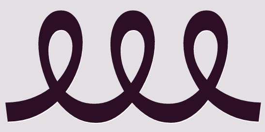

# Emoji Ethnicity

[an article](http://act.mtv.com/posts/apple-responds-to-lack-of-diversity-in-emojis/) by Joey Parker for MTV responding to a petition decrying the lack of diversity in emojis save for two with specific ethnic markers.

# "Colorless green ideas sleep furiously."

But the story is not so simple.  While Apple points to the Unicode consortium, who released their standard in April 2010, Unicode actually based their characters on a core set of 722 emojis in use by the top three mobile phone networks in Japan, DoCoMo, DKKI, and Softbank.  The main heft of Unicode's work was to translate their carrier-specific encodings (which were in ISO-2022-JP), to a single standard that could then play nicely with any international character set.  [Here](http://www.au.kddi.com/ezfactory/tec/spec/img/typeD.pdf), for example, is a chart showing all of KDDI's 822 emoji encodings.

Further, while Unicode does include two faces with deliberate ethnic markers (1F472 👲 Man With Gua Pi Mao and 1F473 👳 Man With Turban), all of the other human faces can be interpreted or rendered in radically different ways.  Every character included in Unicode is given a four-digit hexadecimal number called a "code point."  It then takes a font to actually render these code points as a specific "glyph," which is the graphical skin built upon that hexadecimal foundation that is displayed on screen.  Thus when your computer reads 1F366 it displays 🍦.  But the ice cream cone on my Android phone will look nothing like the ice cream cone on your iPhone.  And so the appearance of a human face can vary depending on the font, or GUI (??) it is rendered in.  Unicode, as their [FAQ](http://www.unicode.org/faq/emoji_dingbats.html) reads, "does not require a particular racial or ethnic appearance —- or for that matter, a particular hair style: bald or hirsute.  However, because there are concerns regarding diversity and user preferences, proposals are being developed by Unicode Consortium members to provide alternate appearances."

The picture becomes muddled even further when we read Unicode's professed desire to encode emojis "primarily on their general appearance, not on an intended semantic."^[Placing the #EmojiEthnicityUpdate controversy at the doorstep of Unicode is ironic because Unicode is the primary engine by which people can translate a character from virtually any language in the world into a file format designed for virtually any other language in the world.  It is a swiss army knife of international natural language processing.]  That is, the Unicode consortium tries as much as possible to curate its list of symbols without any preconceived notions of their meaning.  

Joel Spolsky, in [an article](http://www.joelonsoftware.com/articles/Unicode.html) on Unicode famous among programmers, refers to the characters encoded in unicode as "platonic ideals" that are "floating in heaven."  While A is different than a, A in Courier is semantically equivalent to A in Helvetica.  But if we accept this agnosticism toward the meaning of emojis, encoded emoji characters are then a syntax without semantics.  Like Noam Chomsky's famous sentence showing a syntax without semantics -- "colorless green ideas sleep furiously" --  they are pictographs that can take on entirely new meanings depending on their local applications.  "In fact," the Unicode documentation continues, "when used as emoji, many of these characters acquire multiple meanings based on their appearance; for example, an emoji character for “bank” which includes the letters “BK” has taken on the secondary meaning “bakkureru” (a slang term for evading one’s responsibilities)."

It is for this reason that it's impossible to say precisely how many emoji have been encoded in Unicode after the original 722-character set imported from Japanese mobile characters.  Preexisting pictographs in the Unicode standard, such as 214F ⅏ "Symbol for Samaritan Source" (a character *itself* used in ancient Hebrew to translate between alphabets), could possibly be used in ways unintended, or different from its' original function.^[The original Unicode proposal for this character can be found at <http://std.dkuug.dk/jtc1/sc2/wg2/docs/n3217.pdf>.]  Perhaps it's this kind of semantic drift that can turn any given character into an emoji, which we might look at as a form of flexibility.

Ultimately, this is a story about how practices develop in relation to standards.  Spolsky describes Unicode as a specific "way of thinking about characters."  But with the new means that people have for communicating with one another on mobile phones, the way that these characters "think" are becoming something completely different.  If we accept that there is a Unicode way of thinking about characters, what is the user way of thinking about communication?

# Language Objects

\[*On the connection between language and objects -- how we now use objects to communicate in new ways, and on the material origins of language.  I'll add more here about "token" systems.*\]

Knappett 2011 on why objects are coming to be privileged more than language in models of interaction:

"However, evolutionary approaches aimed at establishing how and why human interaction evolved to the point it has reached today are trying to undo this privileging of lavnguage. […] We should, for now, certainly acknowledge the significance of embedding language in relation to gesture and other forms of communication adn interaction, rather than picking it out as a unique motor for cognitive change." (5)

"the foregrounding of objects as an active component in proximate social interactions."

So, squares with ideas of communication without text.  (a kind of McLuhan tint here, leaving a textual world behind?).

Example of a character that sits ambiguously somewhere between object and text:  Bindu characters in the Batak script from the Indonesian island of Sumatra are "used to disambiguate similar words or phrases."  Is the snake-like bindu pinarjolma ("human-being shaped bindu") and its many different glyph variants an anthropomorphic character with a specific textual purpose, or is it a "graphic page element that does not behave at all as characters," in the words U.S. National Body of Unicode's argument in February 2010 (INCITS/L2/10‐066)?

Here, the distinction between a "graphic object" and a character, a semantic unit, sits in between what Jerome McGann calls the pagespace and the textspace.  

What kinds of objects are these when they are texted, sent from one personal device to the next in a form of "textured" or "fingered speech" that has no oral component, a morphology without an accompanying phonology?